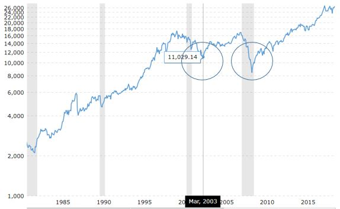

```{r setup, include=FALSE}
knitr::opts_chunk$set(echo = TRUE)
```

Load Libraries:
```{r, message=F, warning=F}
library(ggplot2) 
library(ggfortify)
library(forecast)
library(fpp2)
library(astsa)
```
Source: r - Suppress library comments from output with knitr - TeX - LaTeX Stack Exchange
https://tex.stackexchange.com/questions/152488/suppress-library-comments-from-output-with-knitr

## Hawaiian Hotel Occupancy Rates 

### **I. Data Description**

#### Introduction 

This project involves a time-series analysis of the one of the astsa library databases, the Hawaiian Hotel Occupancy Rates (HOR).  

#### **Data Source**

The source for the data is the State of Hawaii Department of Business, Economic Development & Tourism  website < http://dbedt.hawaii.gov/economic/qser/tourism>. This  site tracks state-wide data for Hawaii tourists and visitors. It examines domestic and international rates and statistics (arrivals, length of stays, daily visitor census, visitor expenditures, etc.). It also groups arrival information by location (US West, US East, Japan, etc.). 

#### **Variable Description** 

The data for *this* project involves statewide Hotel Occupancy Rate (percent of rooms occupied) for Hawaiian hotels. It involves data from first quarter of 1982 to the last quarter of 2015 (the website also lists date from 2016 to 2018 year to date):
```{r}
head(hor)
```
The mean, sd, length, min percentage, max percentage are shown below:
```{r}
mean(hor); sd(hor); length(hor); min(hor); max(hor)
```
Check for Null data:
```{r}
is.null(hor)
```
The statistical summaries are: 
```{r}
str(hor)
summary(hor)
```

#### **Time Series Description**
The data-set used in this analysis involves the quarterly room rates from 1982-Qtr1 to 2015-Qtr.  The format is a Time-Series from 1982 to 2015, that list the quarterly occupation rate: 79 65.9 70.9 66.7, etc. The start, end, frequency, and first three years are below: 
```{r}
start(hor); end(hor)
frequency(hor)
head(hor,12) 
```

### **II. Data Exploration**

### II.A. Plotting Data

#### 1. Basic Plots

#### Boxplot
```{r}
layout(1:1)
par(mar=c(5,5,2,2)) #  Bottom, Left, Top, Right
boxplot(hor, main="Hawaii Hotel Occupancy Rate",
       xlab="Percent Occupancy", horizontal=TRUE,
        col=c("#74546a"))
```

#### **Boxlot across cycles (months, quarters or years)**
```{r}
par(mfrow=c(1,1))
par(mar=c(4,5,2,2)) #  Bottom, Left, Top, Right
boxplot(hor ~ cycle(hor), main="Hawaii Hotel Occupancy Rate",
        ylab="Percent Occupancy",
         xlab="Quarters", horizontal=FALSE,
        col=c("#843b62"))
```

#### Histogram and Density Plots
```{r}
par(mfrow=c(1,2))
hist(hor,breaks = 12, xlab="Percent Occupancy",
     main = paste("Histogram-HOR"),
     col=c("#843b62"))
plot(density(hor), xlab="Percent Occupancy",
     main = paste("Density-HOR"))
```

#### Check for Normalcy
```{r}
qqnorm(hor);qqline(hor)
```

The qqnorm plot shows the occupancy data is normally distributed.

#### 2. Time Series Plots

#### Basic Autoplot
```{r, message=F, warning=F}
par(mfrow=c(1,1))
par(mar=c(2,3,2,2)) 
autoplot(hor, xlab="Years", ylab="Hotel Occupancy Rate") 
```

#### **Time Series Plot with abline**
```{r, message=F, warning=F}
plot(hor, xlab="Years", ylab="Hotel Occupancy Rate")
abline(reg=lm(hor~time(hor)))
```


#### 3. Seasonal Plots

#### Seasonal Plot
```{r, message=F, warning=F}
par(mar=c(3,5,2,2)) #  Bottom, Left, Top, Right
ggseasonplot(hor, qtr.labels=FALSE)
```

#### Seasonal Radar Plot
```{r, message=F, warning=F}
ggseasonplot(hor, qtr.labels=FALSE, polar = TRUE)
```

#### Seasonal 10yr Plot
```{r, message=F, warning=F}
hor_10yr = window(hor,start=2005,NULL)
ggseasonplot(hor_10yr, year.labels = FALSE, continuous = FALSE) + geom_point() + theme_bw()
```

#### Subseries Plot
```{r, message=F, warning=F}
ggsubseriesplot(hor)
```

#### Explore quarters, across years
The plot below show the breakdown of quarters, confirming that Q1 and Q3 see the most hotel occupancy rate. Here is the average per quarter, and standard deviation per quarter:
```{r}

HOccRate.qtr.ts <- ts(hor, start = c(1982, 1), freq = 4)
Hor_Q1 <- window(HOccRate.qtr.ts, start = c(1982, 1), freq = TRUE)
Hor_Q2 <- window(HOccRate.qtr.ts, start = c(1982, 2), freq = TRUE)
Hor_Q3 <- window(HOccRate.qtr.ts, start = c(1982, 3), freq = TRUE)
Hor_Q4 <- window(HOccRate.qtr.ts, start = c(1982, 4), freq = TRUE)

mean(Hor_Q1); mean(Hor_Q2); mean(Hor_Q3); mean(Hor_Q4) 
sd(Hor_Q1);sd(Hor_Q2);sd(Hor_Q3);sd(Hor_Q4)
```

#### Plot Quarters Across Years
```{r, message=F, warning=F}
comb_ts1 <- cbind(Hor_Q1, Hor_Q2, Hor_Q3)
comb_ts2 <- cbind(comb_ts1, Hor_Q4)
plot.ts(comb_ts2, plot.type = "single", 
        col=c("#843b62","#f67e7d","#0b032d","#ffb997"))
legend("bottomright", legend=c("Q1", "Q2","Q3", "Q4"), 
       col=c("#843b62","#f67e7d","#0b032d","#ffb997"),        
       lty=1:1, cex=0.8)
```

#### **Describe the data**
*Describe the data: is it increasing/decreasing,  do you observe changes in its variance and means across months or years, are there any cycles?*

The data is made up of cyclic, seasonal, and random (residual) elements. 

1. The **cyclic data** expands across years, in long-term, peaks and valleys, and is difficult to predict. 

2. The **seasonal data** is shown in quarters - again, Q1 and Q3 peak, while Q2 and Q4 decline (i.e., more hotels are occupied in the Winter and Summer).  The mean occupancy rate for each quarter differ only about 8% (a low mean of 71.8% for Q4 to a high of 79.2% for Q1). The standard deviations differ by about 2% (from a high sd if 5.1% in Q1, to a low of 4% in Q2). 

3. The **random data** is relatively normal, with a slight decrease in variance over time. 


### II. B.**Transformation**
*Describe how you transform/normalize your data (e.g. log) or briefly explain why you do not need to transform*

For analyzing data and using ARIMA models, we must have a stationary series. If the data is not stationary, we must first 'difference' it, in order to apply ARIMA techniques ("Identifying the order of differencing in ARIMA models", 2019). 
Differencing data will de-trend it (remove long-terms trends or cycles) - the syntax: **diff(data)**. 

In this data-set, the long-term cycles can be reduced to stationary series by differencing. That is, analyzing the difference in a value, and its equivalent, several 'time steps' backwards - or time 'lags' (a 'Diff-2' analysis, for instance, involves researching the difference between a current time value, and two steps backwards in time, or two 'lags' backwards). The optimal difference has the least standard deviation between differences (Coghlan, 2019). In this case, Diff-1 is best (sd for Diff-1 is 7.3, Diff-2 is 13.7, and Diff-2: is 26.9).

In addition to differencing data, logging the data will remove seasonality - the syntax: **log(data)**.

If data has _heteroscedasticity_, then we can use logging, and then take the difference of the logged data - syntax:
**diff(log(data))**. 

In this case, our random data has a slightly decreasing variance, so using differencing and logging, diff(log(data)), would be preferable than just a diff(data).

#### Log and Difference Plots

Differencing and logging the data
```{r, message=F, warning=F}
par(mar=c(1,5,2,2)) #  Bottom, Left, Top, Right
par(mfrow=c(3,1))
plot(hor)
plot(log(hor))
plot(diff(hor))
```

#### Difference Autoplot
```{r, message=F, warning=F}
par(mfrow=c(1,1))
par(mar=c(2,3,2,2)) 
autoplot(diff(hor), xlab="Years", main = "HOR Differencing",ylab="Diff-1")
```

#### Differencing and Logging Autoplot
```{r}
par(mfrow=c(1,1))
par(mar=c(2,3,2,2)) 
autoplot(diff(log(hor)), xlab="Years", main = "HOR Differencing and Logging",ylab="Diff-1")

```

### III. Data Decomposition

#### Basic Decomposition
```{r, message=F, warning=F}
hor.decom <- decompose(hor)
plot(hor.decom)
```

#### Plot trends, seasons, residuals
```{r, message=F, warning=F}
par(mfrow=c(3,1))
par(mar=c(3,5,2,2)) #  Bottom, Left, Top, Right
ag <- aggregate(hor.decom$trend)/4
mean(ag, na.rm=TRUE)  # ----mean trend line
plot(hor.decom$trend, ylab="Trend", main="Hawaii Hotel Occupancy Rate") 
abline(h = mean(ag, na.rm=TRUE), col=c("blue"))
plot(hor.decom$seasonal, ylab="Seasonal")
plot(hor.decom$random,  ylab="Residuals") # -- residuals
```

#### Describe the plots

*Trend Data*: The trend plot shows long-tern highs and lows, for the hotel occupancy rate. These are long-term, fluctuating, non-seasonal peaks and valleys. The highs and lows vary in terms of years, probably due to external circumstances and therefore, difficult to predict.

Note - see the Appendix below, where the trend is compared US economic conditions (i.e., shown by the Dow Jones Industrial Average) - where the economy dipped in 2003 and again in 2009. 

*Season Data*: The seasonal data peaks every alternating quarter and declines in alternate quarters.  Here is a plot of the past five years of data (2010-2015). Notice that Qtr-1 and Qtr-3 peak, while  Qtr-2 and Qtr-4 decline. Visits to Hawaii occur mostly in the Winter and Summer.
```{r, message=F, warning=F}
hor_5yr <- window(hor,start=c(2010,1),NULL)
hor_5yr.decom <- decompose(hor_5yr)
par(mfrow=c(1,1))
par(mar=c(3,5,2,2)) #  Bottom, Left, Top, Right
autoplot(hor_5yr.decom$seasonal, ylab="Seasonal")

```

*Residual Plot*: The residual data is normally distributed, around a mean, and is normally distributed. 
```{r}
mean(hor.decom$random[3:134])
par(mfrow=c(2,1))
par(mar=c(3,5,2,2)) #  Bottom, Left, Top, Right
qqnorm(hor.decom$random[3:134])
qqline(hor.decom$random[3:134])
hist(hor.decom$random[3:134], breaks = 24,col=c("#f67e7d"))
```

Again the variance of the residuals decreases slightly over time.

```{r, message=F, warning=F}
autoplot(diff(hor.decom$random))
```

### IV. Regression

#### Build Initial Regression Model

THis first regression is built using the Hawaiian Hotel Occupancy Rate data, without any data transformation. 
```{r, message=F, warning=F}
par(mfrow=c(1,1))
par(mar=c(4,5,2,2)) #  Bottom, Left, Top, Right
hor.fit <- lm(hor ~ time(hor))
plot(hor, main="Hotel Occupancy Rate Data",xlab="Year/Qtr", ylab="Occ. Rate")
abline(hor.fit, col=c("blue"))
```

#### Regression summary 

```{r}
summary(hor.fit)
```

#### Initial Regression interpretation

For this initial regression, the overall p-value, and the slope (Intercept) and the quarterly frequency variables (time(hor)) are all greater than the common alpha level of 0.05, and hence, not statistically significant.


#### Second Regression Model - using diff()

This is a second attempt, using the diff() for building a regression model: 

```{r}
par(mfrow=c(1,1))
par(mar=c(5,5,3,2)) #  Bottom, Left, Top, Right
plot(diff(hor), main="HOR Data (Differencing=1)",xlab="Year/Qtr", ylab="Occ. Rate")
hor.fit <- lm(diff(hor) ~ time(diff(hor)))
abline(hor.fit, col=c("blue"))
summary(hor.fit)
```

For this second regression - again, the overall p-value, and the slope (Intercept) and the quarterly frequency p-values  (time(hor)) are greater than the common alpha level of 0.05, and hence, not statistically significant.


#### Third Regression - Regression without seasonal data 

This third attempt removes the seasonal component from the data, and then runs a regression model. 

```{r}
hor.decom <- decompose(hor)
hor2 <- hor - hor.decom$seasonal
par(mfrow=c(1,1))
par(mar=c(5,5,3,2)) #  Bottom, Left, Top, Right
plot(hor2, main="HOR Data (without Seasonal Component)",xlab="Year/Qtr", ylab="Occ. Rate")
hor2.fit <- lm(hor2 ~ time(hor2))
abline(hor2.fit, col=c("blue"))
summary(hor2.fit)
```
This third regression is better, with an overall p-value under 0.05, but quarterly frequency p-value (0.2510) is still not statistically significant.


#### Fourth Regression - Regression of the trend data 
This fourth regression examines the trend data only.  That is, it removes seasonal and random noise from the initially  observed data. 

```{r}
hor3 <- hor.decom$trend
par(mfrow=c(1,1))
par(mar=c(5,5,3,2)) #  Bottom, Left, Top, Right
plot(hor3, main="HOR Trend Data",xlab="Year/Qtr", ylab="Occ. Rate")
hor3.fit <- lm(hor3 ~ time(hor3))
abline(hor3.fit, col=c("blue"))
summary(hor3.fit)
```
For this regression, all the p-values for the trends are under the common alpha level of 0.05, hence, all  statistically significant.

In summary, these four regressions above show that linear regression does not work well with 1) the data itself, 2) a differencing model (e.g., Diff-1), nor 3) a model that removes seasonal data. It does work well with analyzing the trend element of the data.

### V. ARMA/ARIMA model

#### Plot Autocorrelation ACF

These first two plots (P/ACF) show the autocorrelation for the first regression above. 
```{r, message=F, warning=F}
par(mar=c(2,2,3,2)) #  Bottom, Left, Top, Right
par(mfrow=c(1,1))
acf(resid(hor.fit), main="ACF-Residuals")
```

#### Plot Partial Autocorrelation PACF 
```{r, message=F, warning=F}
par(mar=c(3,2,3,2)) #  Bottom, Left, Top, Right
par(mfrow=c(1,1))
pacf(resid(hor.fit), main="PACF-Residuals")
```

#### ACF/PACF Description
_Describe both plots in terms of lags (tails and cut offs)_

Both the ACF plot and PACF plot 'tail off', suggesting a ARMA or ARIMA model is best. 

Moreover, the ACF Plot shows a steady decline over time, according to a alternating, quarterly seasonal model. Correlation occurs, but declines, for each alternating quarter. That is, the 2nd, 4th, 6th quarters show a correlation that is declining and tailing-off (The data correlates, but declines with lag-2, lag-4, lag-6, etc.). 

Alternatively, the data shows negative, but increasing  correlations with adjacent quarters. That is, the data negatively correlates, but increases, with lag-1, lag-3, lag-5, etc. 

This can be seen in the boxplots, and season plots above (normal and polar). 

The following is a gglagplot, in which you can see the correlations for lag-2, 4,and 6: 
```{r, message=F, warning=F}
par(mar=c(3,2,3,2)) #  Bottom, Left, Top, Right
par(mfrow=c(1,1))
gglagplot(hor, lags=6, seasonal = TRUE, main="Hawaii Hotel Occupancy Rate gglagplot")

```
The chart shows positive but decreasing correlations for lag-2, lag-4, and lag-6.

This decline and increase (for alternating quarters) can also be seen in the *ggAcf* plot (i.e., declines in lag-2,4,6,8; increases in lag-1,3,5,7 etc.): 
```{r, message=F, warning=F}
par(mar=c(3,2,3,2)) #  Bottom, Left, Top, Right
par(mfrow=c(1,1))
ggAcf(hor, main="Hawaii Hotel Occupancy Rate ggAcf")

```

#### Plot Autocorrelation ACF-of Trend Data

The next two plot show the P/ACF plots for the fourth (last) regression model above (i.e. the trend data):  

```{r, message=F, warning=F}
par(mar=c(2,2,3,2)) #  Bottom, Left, Top, Right
par(mfrow=c(1,1))
acf(resid(hor3.fit), main="ACF-Residuals")
```

#### Plot Partial Autocorrelation PACF-initial data
```{r, message=F, warning=F}
par(mar=c(3,2,3,2)) #  Bottom, Left, Top, Right
par(mfrow=c(1,1))
pacf(resid(hor3.fit), main="PACF-Residuals")
```
For the trend data, the ACF data trails off, and the PACF cuts off, suggesting the trend data is an AR model. 


```{r, message=F, warning=F}

```

```{r, message=F, warning=F}

```


```{r, message=F, warning=F}

```


```{r, message=F, warning=F}

```


```{r, message=F, warning=F}

```

### VI. Model Diagnostics

In working through ARIMA models, the first note is that this data series has a seasonal element. We must account for quarters (S = 4) and consider the SAR, SDiff, and SMA, or a sarima(p,d,q) x (P,D,Q)s Model. It is likely a mixed seasonal model, not just a pure seasonal model - but research will discover this. 

#### Build arima model with various p, d, q 
see https://people.Duke.Edu/~rnau/411arim2.Htm

One of the tools used for this analysis was an optimization function found on page 145 of Cowpertweit & Metcalfe's 2009 book, *"Introductory time series with R."*  This was a starting point, but many different models were considered - here are a few (along with AIC and BIC comparisons): 

* sarima(hor, 2,1,1,2,2,1,4) # $AIC 3.529947 $BIC 2.679863
* sarima(hor, 1,1,1,2,2,1,4) # $AIC 3.446651 $BIC 2.575151
* sarima(hor, 2,0,1,2,2,1,4) # $AIC 3.436138 $BIC 2.564638
* sarima(hor, 2,1,1,2,1,1,4) # $AIC 3.304267 $BIC 2.432766
* sarima(hor, 2,0,0,1,1,1,4) # $AIC 3.297192 $BIC 2.404275
* sarima(hor, 1,0,0,1,1,1,4) # $AIC 3.281742 $BIC 2.367408

Here is the function: 
```{r, message=F, warning=F}
get.best.arima <- function(hor, maxord = c(1,1,1,1,1,1))
{
  best.aic <- 1e8
  n <- length(hor)
  for (p in 0:maxord[1]) for(d in 0:maxord[2]) for(q in 0:maxord[3])
    for (P in 0:maxord[4]) for(D in 0:maxord[5]) for(Q in 0:maxord[6])
    {
      fit <- arima(hor, order = c(p,d,q),
                   seas = list(order = c(P,D,Q),
                               frequency(hor)), method = "CSS")
      fit.aic <- -2 * fit$loglik + (log(n) + 1) * length(fit$coef)
      if (fit.aic < best.aic)
      {
        best.aic <- fit.aic
        best.fit <- fit
        best.model <- c(p,d,q,P,D,Q,S=4)
      }
    }
  list(best.aic, best.fit, best.model)
}


best.arima.hor <- get.best.arima( hor,
                                  maxord = c(2,2,2,2,2,2))
best.fit.hor <- best.arima.hor[[2]]
acf( resid(best.fit.hor) )
best.arima.hor[[3]]
```
(Reference: Metcalfe & Cowpertwait, 2009, 145)

#### Select the best model and explain why it is the best

The top two models researched, in terms of AIC and BIC, are as the follows:
First Model:
```{r, message=F, warning=F}
sarima(hor, 2,1,1,2,2,1,4)
```
Second Model:
```{r, message=F, warning=F}
sarima(hor, 1,1,1,2,2,1,4)
```


**Evaluation**: The second model, sarima(hor, 1,1,1,2,2,1,4), is probably better, because although the AIC and BIC favor first model, sarima(hor, 2,1,1,2,2,1,4), neither the ar1 or ma1 is statistically significant.  Here is the ar1 and ma1 from that model: 

* ar1        0.0387 0.4374   0.0885  *0.9296*
* ma1       -0.2223 0.4482  -0.4959  *0.6209*


#### Run residuals diagnostics
*Describe whether your residuals are good or bad (correlated/not correlated, normally/not normally distributed, have zero/biased mean, have constant/not constant variance*.

#### Summary for sarima(hor, 1,1,1,2,2,1,4):

```{r, message=F, warning=F}
bestmodel <- sarima(hor, 1,1,1,2,2,1,4)
summary(bestmodel$fit)
```

#### Plot Residuals 
```{r, message=F, warning=F}
par(mfrow=c(1,1))
par(mar=c(3,5,2,2)) #  Bottom, Left, Top, Right
autoplot(resid(bestmodel$fit))
```

**Note**: These behave as a white noise process - with mean zero. The variance, as mentioned above, decreases slightly over time. 

#### Q-Q plot - Examine residual for normal distribution 
```{r, message=F, warning=F}
par(mfrow=c(2,1))
par(mar=c(3,5,2,2)) #  Bottom, Left, Top, Right
qqnorm(resid(bestmodel$fit))
qqline(resid(bestmodel$fit))
hist(resid(bestmodel$fit), breaks = 24,col=c("#843b62"))
```

#### ACF Plot 
```{r}
acf(resid(bestmodel$fit))
```

#### Check Residuals
```{r, message=F, warning=F}
checkresiduals(resid(bestmodel$fit))
```

**Evaluation**: Residuals look OK.  The ACF shows all lags within the blue lines; and the data is normally distributed. 


### VII. Summary

This project has examined Hawaiian Hotel Occupancy Rates.

It plotted basic data (boxplots, histograms, density plots, and seasonal plots.  From quarterly breakdowns, the first and third quarters have consistently higher hotel occupancies rates than the second and fourth quarters. 

The data, then, has a consistent seasonal element (quarterly trends), that correlation somewhat over time.  When the seasonal data, and random data is removed, the data pattern is left with a long cyclic element, that peaks and declines over various and changing year.  The cyclic elements can be hard to predict. 

The data was examined within several linear regression models - and it was found that the decomposed trend data provided the best regression models.  Linear regression is not appropriate and/or significant for other cases. 

P/ACF plots were shown regarding the data itself, as well as the decomposed trend element. Through these, and gglagplots, one could see that quarters correlated positively or negatively . alternating every other cycle.  That is, the 2nd , 4th , and 6th  quarters showed correlations declining and tailing-off, while 1st, 3rd, and 5th showed increasing correlation time.

Model selection and diagnostics were analyzed regarding a mixed seasonal model that took quarters into account:  a sarima(p,d,q) x (P,D,Q) S model (where S=4). 


### Appendix I - Forecast

This was just a quick forecast, for four years ahead:
```{r, message=F, warning=F}
sarima.for(hor, n.ahead = 8, 1,1,1,2,2,1,4)
```


```{r, message=F, warning=F}

```

### Appendix II - Economic data

What could cause cyclic down-turns? One possibility is the economy. So, I checked the Stock Market (Dow Jones Industrial Average) and compared it to the Hawaiian Occupancy Rates

These charts show the Hawaiian Hotel Occupancy Rate Trend Data compared to US economic conditions (i.e., shown by the Dow Jones Industrial Average) - where the economy dipped in 2003 and again in 2009. 

####Setup
Setup your working directory (where the 'dj_yr.csv' file is located), 
```{r, message=F, warning=F}
path <- 'C:/Users/hp/OneDrive/db/j5/IU/ts/project/'	
```

Read from CSV (Paste concatenates text):
```{r, message=F, warning=F}
csv_file <- paste(path, 'dj_yr.csv', sep = "")
dj_yr  = read.table(csv_file, header=TRUE, sep=",", stringsAsFactors = FALSE)
```

#### DJIA TIme Series

Create time series, using quarters for the Dow Jones Industrial Average, and plot:
```{r, message=F, warning=F}
dy_yr.ts = ts(dj_yr[,2], start = 1985, frequency=4)
start(dy_yr.ts);end(dy_yr.ts)
par(mfrow=c(1,1))
autoplot(dy_yr.ts) 
```

#### Subset of Hotel Data
Get a subset of Hotel data
```{r, message=F, warning=F}
hor_85_15 = window(hor.decom$trend,start=c(1985,1), end=c(2015,4))

```

#### Plots Compared

Compare plots visually:
```{r, message=F, warning=F}
par(mfrow=c(2,1))
par(mar=c(3,5,2,2)) #  Bottom, Left, Top, Right
plot(dy_yr.ts,  type='l', ylab="Dow Jones Avg")
plot(hor_85_15,  type='l', ylab="HI Occ Rates")
```

Of course, this is just visual. Further analysis would have to be done, to determine if the economic downturns in the economy (e.g. 2003 and 2009, impacted the Hotel Occupancy Rates)

Here is image from Investing.com showing economic down-turns in 2003 and 2009 (Source: "Dow Jones Industrial Average Historical Rates - Investing.com", 2019):





### Bibliography

34 Beautiful Color Palettes For Your Next Design Project. (2019). Retrieved from https://digitalsynopsis.com/design/beautiful-color-schemes-combinations-palettes/

Coghlan, A. (2019). Using R for Time Series Analysis - Time Series 0.2 documentation. Retrieved from https://a-little-book-of-r-for-time-series.readthedocs.io/en/latest/src/timeseries.html#differencing-a-time-series

Cowpertweit, P., & Metcalfe, A. (2009). Introductory time series with R (1st ed.). Dordrecht: Springer.

Department of Tourism. (2019). Retrieved from http://dbedt.hawaii.gov/economic/qser/tourism/
Dow Jones Industrial Average Historical Rates - Investing.com. (2019). Retrieved from https://www.investing.com/indices/us-30-historical-data

Identifying the order of differencing in ARIMA models. (2019). Retrieved from https://people.duke.edu/~rnau/411arim2.htm

Marx, D. (2014). Suppress library comments from output with knitr. Retrieved from https://tex.stackexchange.com/questions/152488/suppress-library-comments-from-output-with-knitr

Stoffer, D. (2019). R: Arima Modeling. Retrieved from https://www.datacamp.com/courses/arima-modeling-with-r


### Final Thoughts

Thanks for the chance to do this project and for the learning. 

- Jarrell


